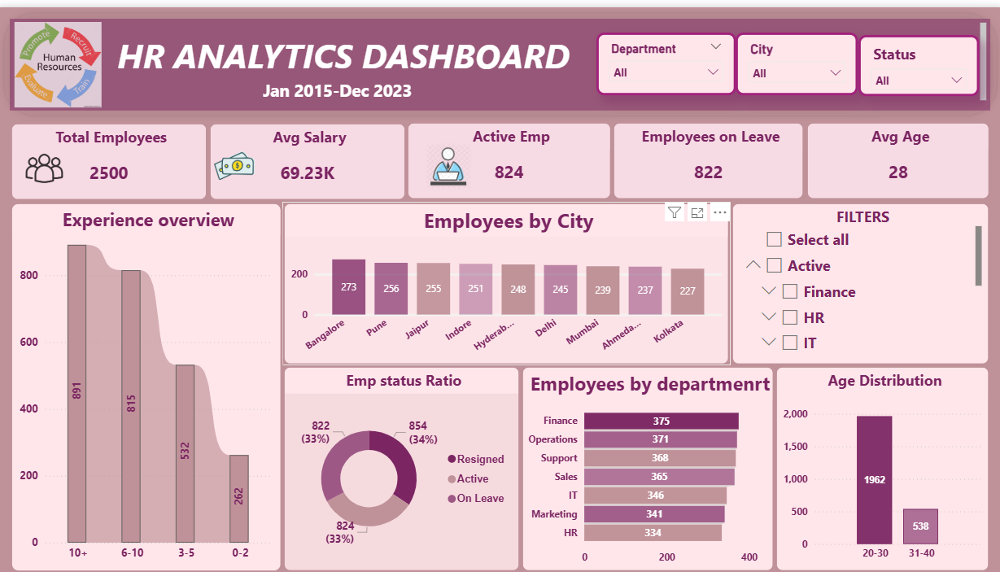

# 📊 HR Insights Dashboard (Power BI)

## 📌 Overview
This project showcases an interactive HR Insights Dashboard built using Power BI to analyze employee data and generate meaningful insights.

## 🔍 Key Insights
- Employees on leave are almost equal to active employees, which may impact productivity.
- Majority of employees fall within the 20–30 age group.
- Finance department has the highest workforce.

## 🛠 Tools Used
- Power BI
- Microsoft Excel

## 📊 Features
- Employee Status Analysis
- Department-wise Distribution
- Age Group Insights
- City-wise Analysis

## 📸 Dashboard Preview

## 🔗 Connect with Me
LinkedIn:https://www.linkedin.com/in/poonam-gupta-964252353 

Email: poonamguptapoonam51@gmail.com
